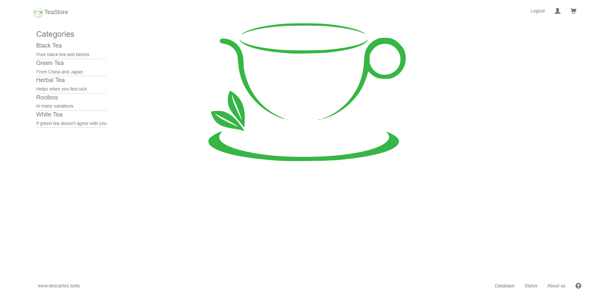
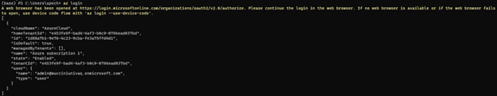
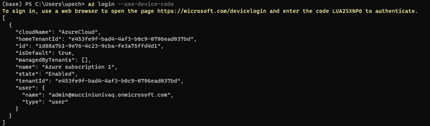
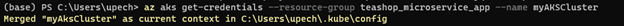
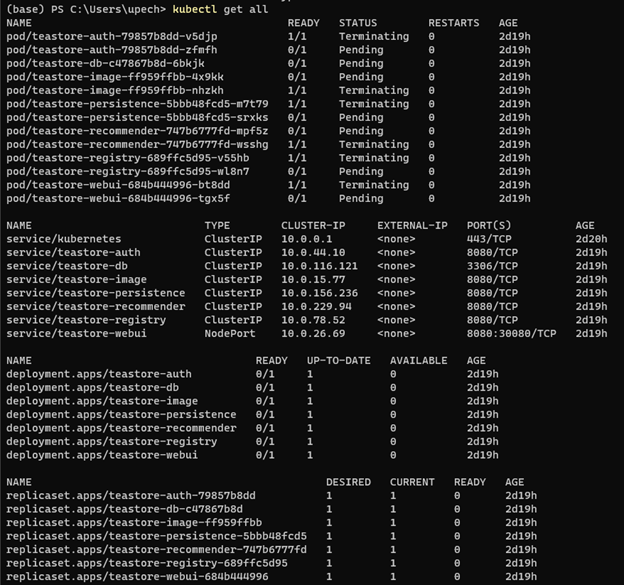
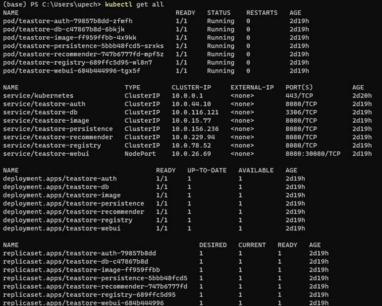

# Tea Store microservice application

We use the tea store microservice application from [Descartes Research](https://github.com/DescartesResearch/TeaStore/tree/master). The TeaStore is a distributed micro-service reference and test application featuring five distinct services plus a registry.


## Steps to run the application on AKS

1. Login to your Azure account using the command:<br/>

   ```
   az login
   ```

   

   It requires to add device code as well which can be done by using: <br/>

   ```
   az login –use-device-code
   ```

   

2. Create resource group with Terraform: <br/>
```bash
# drop into proper directory
cd infrastructure/azure/

# initialize terraform plugins

terraform init

# deploy resources

terraform apply

# set variables to connect to aks cluster

export RESOURCE_GROUP=$(terraform output -raw green_name)
export LOCATION=$(terraform output -raw green_location)
export CLUSTER_NAME=$(terraform output -raw aks_name)

# get back to repository root

cd ../../
```

3. Connect to the cluster: <br/>

```bash
az aks get-credentials \
 --resource-group $RESOURCE_GROUP \
 --name $CLUSTER_NAME
```

   

4. Deploy the teastore application to AKS using the instructions provided in the repo from DescartesResearch. <br/>

   ```bash
    kubectl create -f https://raw.githubusercontent.com/DescartesResearch/TeaStore/master/examples/kubernetes/teastore-clusterip.yaml   
    ```

5. Check the status of the deployed application using: <br/>

   ```
   kubectl get all -A
   ```

   

   Wait until all of the pods are in running status.

   

6. Use port-forwarding to access the application locally.
   After all of the pods are running, we can port-forward the web-ui to access the UI locally using the command: <br/>

   ```
   kubectl port-forward service/teastore-webui --namespace=default 8080:8080
   ```

You can access the website on http://localhost:8080/ 

8. Load testing using Locust: <br/>
   The repo for teastore application also comes with a python script to run load testing using Locust.

   ```
   locust -f locustfile.py
   ```

9. Carbon intensity emission tracker using Kepler:
   We use [Kepler](https://github.com/sustainable-computing-io/kepler/tree/main) to get the carbon intensity values for the different pods running the different microservices in the tea store application.

   We deployed Kepler in AKS using deployment using manifest. We first tried deploying it using Helm which was easier but with the Helm deployment, we got empty query results from Prometheus. We then switched to deployment using manifests. Before deploying Kepler, it is important to deploy the monitoring stack using the following steps:

   ```bash
    kubectl apply --server-side -f infrastructure/kepler-prometheus/manifests/setup
    until kubectl get servicemonitors --all-namespaces ; do date; sleep 1; echo ""; done
    kubectl apply -f infrastructure/kepler-prometheus/manifests/
   ```

   It will take around 8-10 mins. You can monitor the pods state the following command:
    ```bash
    kubectl get po -n monitoring -w
    ```

   This will run the pods required for monitoring using Prometheus and Grafana. We can then use port-forwarding to access the Prometheus Web application and Grafana dashboard locally.

   ```bash
   kubectl port-forward service/prometheus-k8s --namespace=monitoring 9090:9090
   ```

   ```bash
   kubectl port-forward service/grafana 3000:3000 --namespace=monitoring
   ```

   The Grafana dashboard login credentials values are: <br/>
   username: admin<br/>
   password: admin

   The Kepler deployment also requires the following:<br>

   - kubectl v1.21+
   - make
   - go

   We can use the following commands to deploy Kepler:

   ```bash
    kubectl apply -f kepler/generated-manifest/deployment.yaml
   ```

   We had issues with the makefile when running the above commands with the latest version of Kepler. However, we were able to run it using version: release-0.5.4.

# Machine learning part

To save the data from prometheus. Navigate to ml directory and run save_data.py file (where it will save the data every minute). Make sure that you installed necessary packages

```bash
cd ml

python save_data_kepler.py
```

It will save data to data_points_kepler.csv file, then you can start machine learning part with the following command:

```bash
python ml.py
```
Also, you can choose the machine learning algorithm in model_choice variable and get accuracy. 

## Clean up

When you are done testing, delete the resources using the following command.

```bash
az group delete --resource-group $RESOURCE_GROUP
```

If you deployed the Azure resources using Terraform, you can run this command instead.

```bash
cd infrastructure/azure/
terraform destroy
```
